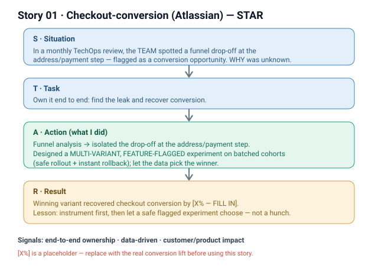

# 01 · Checkout-conversion experiment (Atlassian, M3)

**Signals:** end-to-end ownership · data-driven decisions · customer/product impact · turning an observation into shipped value
**Answers questions like:** "a project you owned end to end" · "a decision you drove with data" · "measurable impact you're proud of" · "you turned a problem into an opportunity" · "how do you de-risk a change in production?"

## The story (detailed STAR)
- **S — Situation:** Every month our Commerce team runs a **TechOps review** where *we* share dashboards and operational metrics. In one of these, **we spotted a clear drop-off on the checkout funnel chart at the address/payment step** for enterprise customers, and the team flagged it as a **conversion opportunity**. *(That's the "we" — the team surfaced it together.)*
- **T — Task:** **I picked it up and owned it end to end** — turning that observation into a measured, shipped improvement. The hard part: we knew *where* the drop-off was, not *why*, and there was **no spec** for the fix — just a metric to move.
- **A — Action (this is where it's "I"):**
  1. **Characterized the drop-off** — dug deeper into the funnel data to see *who* was dropping and at which sub-step [add the specific: e.g., a form-validation step / a payment method].
  2. **Chose an experiment over a guess** — instead of shipping one hunch, I designed a **multi-variant, feature-flagged** experiment to test several hypotheses at once.
  3. **De-risked the rollout** — released across **batched user cohorts** (small cohorts first), so we could measure cleanly and **roll back instantly** if any variant hurt conversion.
  4. **Aligned the crew** — worked with [PM / design / payments] on the variants and the success metric, and iterated as data came in.
- **R — Result:** The winning variant **recovered checkout conversion by [X% — FILL IN]** [→ ~$[Y] ARR / [N] more completed purchases/month]. Beyond the number, it set a **reusable pattern** for the team: *spot it in the monthly review → instrument → flagged multi-variant experiment → let data decide.*

## Key decisions I'd defend
- **Multi-variant over a single fix** — we didn't know the *why*, so testing several hypotheses in parallel found the answer faster than serial guessing. *(Cost: more variance to manage.)*
- **Batched cohorts + feature flag** — safety and instant rollback on a revenue-critical surface beat a big-bang launch.

## Likely follow-up probes (be ready)
- *"How did you pick the success metric?"* → conversion at the address/payment step, guardrailed on overall completion + [revenue].
- *"What if a variant hurt conversion?"* → that's why cohorts + flags — auto-roll-back, small blast radius.
- *"What was YOUR part vs the team's?"* → team surfaced it in the review; **I** owned diagnosis → experiment design → rollout → the shipped win.

## 60-second version (say this out loud)
"Every month our Commerce team does a TechOps review of our dashboards. In one, we spotted a drop-off on the checkout funnel at the address/payment step and flagged it as a conversion opportunity. I took it end to end — I characterized the drop-off in the data, then instead of guessing a fix I designed a multi-variant, feature-flagged experiment and rolled it out across batched cohorts so we could measure safely and roll back instantly. The winning variant recovered conversion by [X%]. It also gave the team a repeatable play: spot it in review, instrument, run a safe experiment, let data decide."

## ⚠ Fill in before using
- [ ] Real conversion lift (%) and/or $ / count impact.
- [ ] The specific sub-step / hypothesis that won.
- [ ] Who you partnered with (PM, design, payments) and how many variants / how long it ran.
