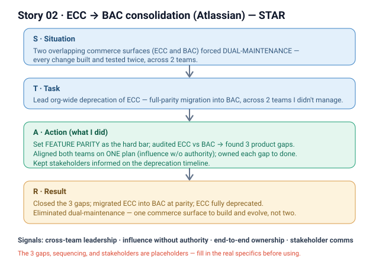

# 02 · ECC → BAC consolidation (Atlassian)

**Signals:** cross-team leadership · influence without authority · end-to-end ownership · communication to stakeholders
**Answers questions like:** "a time you drove change across teams" · "you influenced without authority" · "you led a migration/deprecation" · "you aligned multiple stakeholders" · "how do you retire something people still depend on?"

## The story (detailed STAR)
- **S — Situation:** We had **two overlapping commerce surfaces** — End-Customer Contacts (ECC) and Billing & Account Centre (BAC) — that did similar things. Keeping both alive meant **dual-maintenance**: every change had to be built and tested twice, across **2 teams**. *(That's the shared context — the redundancy was a known org-level cost, not something I discovered alone.)*
- **T — Task:** **I led the org-wide deprecation of ECC end to end** — the goal wasn't just to turn ECC off, it was to migrate everything into BAC with **full feature parity** so no customer lost a capability, and to do it across **2 teams** I didn't manage. The hard part: **influence without authority** — I couldn't order either team to reprioritize; I had to align them.
- **A — Action (this is where it's "I"):**
  1. **Established parity as the bar** — I audited what ECC did versus what BAC covered and found **3 product gaps** where BAC couldn't yet replace ECC. I made closing those gaps the explicit precondition for deprecation, so "migration" meant *no regression*, not *near enough*.
  2. **Drove the 2 teams to one plan** — I aligned both teams on a single sequenced plan [FILL IN — how you sequenced it: e.g., gap-close first, then cutover] and kept ownership of each gap clear across the team boundary.
  3. **Closed the 3 gaps** — [FILL IN — what the 3 gaps were and who built each]; I tracked them to done so BAC reached true feature parity.
  4. **Communicated to stakeholders** — I kept [FILL IN — which stakeholders: PMs / eng leads / customers?] informed on the deprecation timeline and what changed for anyone on ECC.
- **R — Result:** ECC was fully deprecated with its capabilities migrated into BAC at feature parity; the **3 product gaps were closed** and **dual-maintenance between the two commerce surfaces was eliminated** — one surface to build, test, and evolve instead of two. *(The "we" is the 2 teams who shipped it; the "I" is the parity bar, the cross-team plan, and driving it to done.)*

## Key decisions I'd defend
- **Feature parity as a hard precondition** — deprecating before closing the 3 gaps would have regressed customers. Making parity non-negotiable was slower but meant a clean cutover with nothing lost. *(Cost: [FILL IN — added delay / effort to close gaps].)*
- **Consolidate onto BAC rather than keep both** — dual-maintenance was a permanent tax on 2 teams; one surface removes that recurring cost even though the migration itself was one-time work.

## Likely follow-up probes (be ready)
- *"How did you get 2 teams to reprioritize without authority?"* → [FILL IN — the real lever: shared cost of dual-maintenance / leadership sponsorship / a plan that made the win obvious]. Framing it as eliminating a recurring tax on both teams made the case.
- *"What were the 3 product gaps?"* → [FILL IN — the actual 3 gaps]. Each had to be closed in BAC before ECC could go dark.
- *"How did you make sure no customer lost a capability?"* → parity audit up front (ECC vs BAC), gaps tracked to done, [FILL IN — any validation/verification step before cutover].
- *"What was YOUR part vs the teams'?"* → the 2 teams built the fixes; **I** set the parity bar, found the 3 gaps, aligned both teams on one plan, and drove the deprecation to done.

## 60-second version (say this out loud)
"We had two overlapping commerce surfaces — End-Customer Contacts and Billing & Account Centre — and keeping both meant every change was built and tested twice across two teams. I led the org-wide deprecation of ECC end to end. I made feature parity the hard bar: I audited ECC against BAC, found three product gaps, and said we don't turn ECC off until those are closed so no customer regresses. Then, without managing either team, I aligned both on one plan and drove it to done. We closed the three gaps, migrated everything into BAC at parity, and eliminated the dual-maintenance between the two surfaces."

## ⚠ Fill in before using
- [ ] What the **3 product gaps** actually were, and who built each.
- [ ] How you **sequenced** the plan and the real lever you used to align 2 teams without authority.
- [ ] Which **stakeholders** you communicated to and the deprecation timeline.
- [ ] Any **validation step** that confirmed no customer lost a capability at cutover.
- [ ] The **cost/delay** of holding the parity bar (for the "decisions I'd defend" trade-off).
