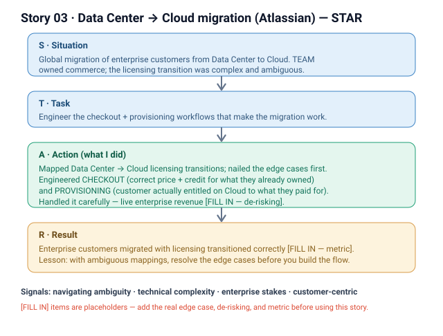

# 03 · Data Center → Cloud migration (Atlassian)

**Signals:** navigating ambiguity · technical complexity · enterprise/customer stakes · customer-centric
**Answers questions like:** "the most complex or ambiguous problem you've worked on" · "a high-stakes migration you were part of" · "a customer-impacting change you handled carefully" · "how do you make progress when the requirements aren't clear?"

## The story (detailed STAR)
- **S — Situation:** Atlassian was running a **global migration of enterprise customers from Data Center to Cloud**. *We* — the Commerce org — owned the money-and-entitlement side of that move: how a customer who already owned Data Center licenses could **check out and get provisioned on Cloud** without losing or double-paying for what they'd bought. The genuinely hard part was the **licensing transition** — Data Center and Cloud don't price, package, or entitle the same way, so mapping one to the other was **complex and, at the start, ambiguous** [FILL IN — the specific mismatch, e.g. per-user vs. per-tier, term vs. subscription, feature bundling].
- **T — Task:** **I was responsible for engineering the checkout and provisioning workflows** that made this migration work end to end for enterprise customers — turning an ambiguous licensing problem into concrete, reliable flows. The stakes were high: these are **large enterprise accounts** [FILL IN — segment / deal size], and a wrong entitlement or a broken checkout directly hits a paying customer.
- **A — Action (this is where it's "I"):**
  1. **Mapped the licensing transitions** — worked through how each Data Center licensing state should translate into the equivalent Cloud entitlement, and pinned down the edge cases before writing the flow [FILL IN — the trickiest case you handled, e.g. mid-term, mixed products, over/under seat counts].
  2. **Engineered the checkout workflow** — built the path an enterprise customer takes to purchase / convert to Cloud, so the price they see and the credit for what they already own are correct.
  3. **Engineered the provisioning workflow** — made sure that once checkout completed, the customer was **actually entitled** on Cloud to what they paid for, with the licensing carried across correctly.
  4. **Handled the complexity carefully** — because this touched live enterprise customers, I [FILL IN — how you de-risked: e.g. staged rollout, validation/reconciliation checks, partnered with billing/entitlements/support, dry-runs on real account shapes].
- **R — Result:** Enterprise customers could **migrate from Data Center to Cloud with their licensing transitioned correctly** through the checkout and provisioning flows I built [FILL IN — the outcome metric: e.g. # of enterprise customers migrated / % of migration volume these flows carried / error or reconciliation rate]. [FILL IN — the lesson you'd draw, e.g. "with ambiguous mappings, nail the edge cases on paper before you build the flow."]

## Key decisions I'd defend
- **Resolve the licensing mapping before building the flow** — the ambiguity was in *what* the entitlement should become, not *how* to code it; getting the mapping right up front avoided shipping a flow that quietly mis-entitled paying enterprise customers. *(Cost: slower start.)*
- **Treat checkout and provisioning as one correctness contract** — a checkout that charges correctly but provisions the wrong entitlement is still a broken migration, so I owned both halves as one path. [FILL IN — confirm you owned both, or scope to the half you owned.]

## Likely follow-up probes (be ready)
- *"What made the licensing transition complex?"* → [FILL IN — the concrete Data Center vs. Cloud model mismatch and the edge case that made mapping non-obvious].
- *"How did you handle the ambiguity — who decided the right mapping?"* → [FILL IN — who you aligned with: product / billing / pricing / legal-commercial, and how you converged].
- *"This touched live enterprise revenue — how did you keep it safe?"* → [FILL IN — your de-risking: staged rollout, reconciliation/validation, rollback, monitoring].
- *"What was YOUR part vs. the team's?"* → the migration was an org-wide effort; **I** engineered the checkout and provisioning workflows and the licensing-transition logic within them.

## 60-second version (say this out loud)
"Atlassian was migrating enterprise customers globally from Data Center to Cloud, and my team owned the commerce side — how a customer who already owned Data Center licenses checks out and gets provisioned on Cloud. The hard, ambiguous part was the licensing transition: Data Center and Cloud don't price or entitle the same way, so I had to map one to the other and nail the edge cases before building anything. I engineered the checkout workflow so the price and credit for what they already owned were correct, and the provisioning workflow so they ended up actually entitled on Cloud to what they paid for. Because this was live enterprise revenue, I [FILL IN — de-risking]. The result was enterprise customers migrating with their licensing carried across correctly [FILL IN — metric]."

## ⚠ Fill in before using
- [ ] The specific Data Center vs. Cloud licensing mismatch and the trickiest edge case you handled.
- [ ] Who you aligned with to decide the correct mapping (product / billing / pricing).
- [ ] How you de-risked the change on live enterprise customers (rollout, validation, rollback).
- [ ] Whether you owned both checkout AND provisioning, or one half.
- [ ] The outcome metric (customers migrated / migration volume carried / error rate) and the lesson.
