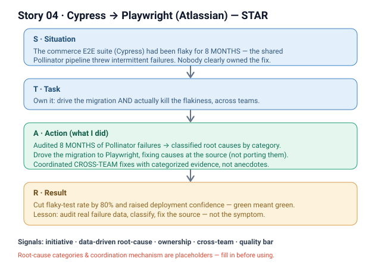

# 04 · Cypress → Playwright migration (Atlassian, Commerce)

**Signals:** initiative / bias for action · data-driven root-cause analysis · ownership · cross-team coordination · raising the quality bar
**Answers questions like:** "a time you improved a process or quality" · "you took initiative on something nobody owned" · "you used data to fix a systemic problem" · "how do you raise the reliability bar?" · "a cross-team effort you drove"

## The story (detailed STAR)
- **S — Situation:** Our commerce E2E suite ran on Cypress, and *we* had a chronic flaky-test problem — the shared **Pollinator** pipeline had been throwing intermittent failures for **8 months**. *(That's the "we" — the whole team lived with red builds and lost trust in the suite.)* Nobody clearly owned fixing it; teams mostly re-ran until green.
- **T — Task:** **I picked it up and owned it** — drive the commerce E2E suite migration from Cypress to Playwright and, more importantly, actually kill the flakiness rather than paper over it. The hard part: no spec, no single owner, and the failures spanned **multiple teams'** tests.
- **A — Action (this is where it's "I"):**
  1. **Audited the evidence, didn't guess** — went through **8 months of Pollinator failures** instead of anecdotes, so the fix would target real causes.
  2. **Classified root causes** — grouped the failures into categories [FILL IN — the actual buckets, e.g. timing/race conditions, selector brittleness, test-data setup, environment] so each class had a clear remedy.
  3. **Drove the migration to Playwright** — moved the commerce E2E suite over, using the classification to fix causes as I migrated rather than porting the flakiness forward.
  4. **Coordinated cross-team fixes** — many failing tests were owned by other teams, so I [FILL IN — how: e.g. filed categorized issues, paired with owners, set migration guidelines] to get the fixes landed across the org.
- **R — Result:** **Cut the flaky-test rate by 80%** and **raised deployment confidence** — the team could trust a green build again instead of re-running until it passed. It also left behind a **repeatable pattern**: audit real failure data → classify root causes → fix at the source, not the symptom.

## Key decisions I'd defend
- **Audit 8 months of data before touching code** — flakiness invites guessing; the classification is what made the 80% cut targeted instead of luck. *(Cost: slower start.)*
- **Fix root causes during the migration, not after** — porting tests as-is would have carried the flakiness into Playwright. Migrating *and* remediating together meant we only touched each test once.
- **Coordinate across teams rather than fix only "my" tests** — the suite is only trustworthy if the *whole* pipeline is green, so I drove fixes into other teams' tests too.

## Likely follow-up probes (be ready)
- *"How did you measure the 80%?"* → flaky-test rate from Pollinator failure data, before vs. after [FILL IN — the exact metric/window].
- *"What were the biggest root-cause buckets?"* → [FILL IN — top categories and the fix for each].
- *"How did you get other teams to do the work?"* → [FILL IN — the coordination mechanism]; I brought them categorized evidence, not just "your test is flaky."
- *"Why Playwright over fixing Cypress?"* → [FILL IN — the concrete reasons, e.g. auto-waiting, tracing, parallelism] that removed whole classes of flakiness.
- *"What was YOUR part vs the team's?"* → the team owned individual tests and lived with the pain; **I** owned the audit → classification → migration → cross-team coordination → the 80% win.

## 60-second version (say this out loud)
"Our commerce E2E suite was on Cypress and had been flaky for eight months — the shared Pollinator pipeline threw intermittent failures and nobody really owned it; teams just re-ran until green. I took it end to end. Instead of guessing, I audited eight months of Pollinator failures, classified the root causes, and drove the migration to Playwright — fixing causes as I went rather than porting the flakiness forward. A lot of the failing tests belonged to other teams, so I coordinated the fixes across the org with categorized evidence. We cut the flaky-test rate by 80% and got deployment confidence back — a green build meant green again. It also gave the team a repeatable play: audit the real failure data, classify, fix at the source."

## ⚠ Fill in before using
- [ ] The actual root-cause categories you found (timing, selectors, test data, environment, …).
- [ ] How you coordinated cross-team fixes (filed issues, paired, guidelines, owner list).
- [ ] The exact way the flaky-rate / 80% was measured (metric, before-vs-after window).
- [ ] The concrete reasons Playwright over Cypress (auto-wait, tracing, parallelism, …).
