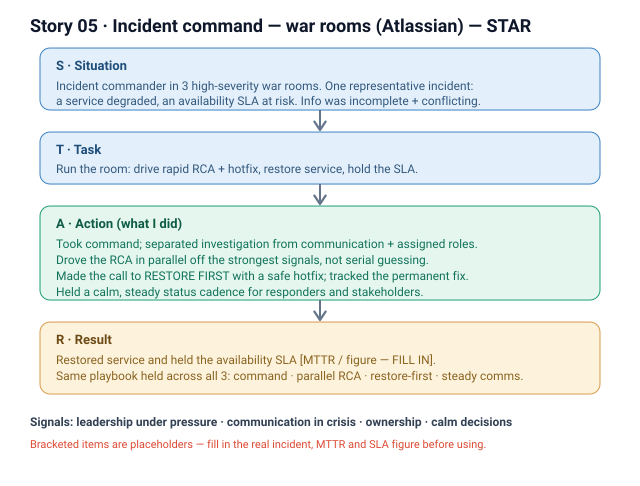

# 05 · Incident command — war rooms (Atlassian)

**Signals:** leadership under pressure · clear communication in crisis · ownership/accountability · calm decision-making
**Answers questions like:** "a high-pressure situation you led through" · "a time you led during a crisis/outage" · "you had to make a fast call with incomplete information" · "how you communicate under stress" · "a time you took accountability when things broke"

## The story (detailed STAR)
- **S — Situation:** Over my time on the Commerce team I served as **incident commander in 3 high-severity war rooms**. For this answer I'll go deep on **one representative incident** — `[FILL IN — pick one real incident: which service/surface, what customers saw, when]` — and note that the *pattern* held across all three. In that incident, `[FILL IN — what broke and the customer impact, e.g. a checkout/billing surface degraded for a segment of customers]`, and we were **at risk of breaching an availability SLA**. *(That's the "we" — engineers, on-call, and support were all in the room; multiple people were surfacing signals at once.)*
- **T — Task:** As **incident commander**, my job wasn't to personally fix the bug — it was to **run the room**: drive a **rapid RCA**, get a **hotfix** out to **restore service**, and **hold the availability SLA** while keeping everyone aligned. The hard part: **incomplete, conflicting information under a live clock**, with stakeholders watching.
- **A — Action (this is where it's "I"):**
  1. **Took command and made roles explicit** — I owned the incident, separated *investigation* from *communication* so responders could focus while I `[FILL IN — how you assigned: e.g. named a comms lead / a scribe / an ops owner]`.
  2. **Drove the RCA fast, in parallel** — worked the room to narrow hypotheses from the strongest signals rather than chasing every lead serially, and `[FILL IN — the key diagnostic step that isolated root cause]`.
  3. **Made the call to restore first** — chose to **ship a hotfix to restore service** and protect the SLA before a full fix, accepting a follow-up for the permanent remediation. `[FILL IN — the specific mitigation/hotfix and how it was rolled out safely]`
  4. **Communicated on a steady cadence** — kept a **calm, regular status drumbeat** to responders and stakeholders so no one had to interrupt the fix to ask "what's happening?", and `[FILL IN — who you kept updated: e.g. support/leadership/customers]`.
  5. **Closed the loop** — after service was restored, drove `[FILL IN — the postmortem / action items / follow-up fix]`.
- **R — Result:** We **restored service and held the availability SLA** `[FILL IN — MTTR / time-to-mitigate and the SLA figure if you have it]`. Across **all 3 war rooms** the same playbook held: *take clear command → parallelize the RCA → restore first, perfect later → communicate on a steady cadence.* `[FILL IN — any durable improvement that came out of it, e.g. a runbook / alert / guardrail]`

## Key decisions I'd defend
- **Restore first, root-cause fully second** — on a revenue/SLA-critical surface, a safe hotfix that stops customer pain beats holding out for the perfect fix. *(Cost: a tracked follow-up for permanent remediation — which I owned.)*
- **Separate comms from investigation** — a steady status cadence keeps stakeholders calm and lets responders actually work; silence in a war room is what turns an outage into a panic.

## Likely follow-up probes (be ready)
- *"How did you decide what to fix first with incomplete info?"* → ranked by **customer impact + SLA risk**, worked the strongest signal, and chose the **lowest-blast-radius mitigation** that restored service; `[FILL IN — the concrete signal that drove the call]`.
- *"What was YOUR part vs the team's?"* → the team brought the fix; **I** ran the room — owned the incident, made the restore-first call, assigned roles, and held the communication cadence.
- *"What did you change so it wouldn't happen again?"* → `[FILL IN — postmortem action items / runbook / alerting / guardrail that came out of it]`.
- *"How did you stay calm / keep others calm?"* → explicit roles + a predictable status cadence removed the chaos; people knew what they owned and when the next update was coming.

## 60-second version (say this out loud)
"I've been incident commander in three high-severity war rooms on our Commerce team. In one — `[FILL IN — the incident]` — a `[FILL IN — service]` was degraded and we were at risk of breaching an availability SLA. My job wasn't to fix the bug myself; it was to run the room. I took command, split investigation from communication, and drove the RCA in parallel off the strongest signals. With incomplete info and a live clock, I made the call to ship a hotfix to restore service first and protect the SLA, with a tracked follow-up for the permanent fix. I kept a steady status cadence so responders could focus and stakeholders stayed calm. We restored service and held the SLA `[FILL IN — MTTR/figure]`, and the same playbook — clear command, parallel RCA, restore-first, steady comms — held across all three."

## ⚠ Fill in before using
- [ ] Pick the ONE representative incident: which service/surface, what broke, what customers saw, roughly when.
- [ ] MTTR / time-to-mitigate and the availability SLA figure (if you can state it).
- [ ] The specific hotfix/mitigation and how it was rolled out safely.
- [ ] How you assigned roles (comms lead, scribe, ops owner) and who you kept updated.
- [ ] The postmortem / follow-up action items or durable improvement that came out of it.
