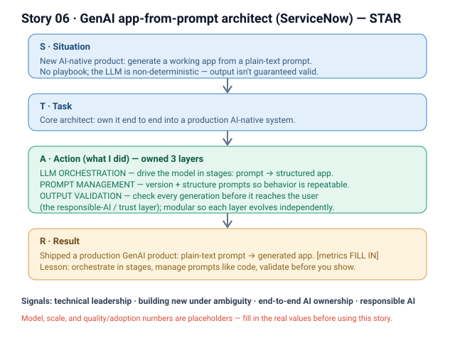

# 06 · GenAI app-from-prompt architect (ServiceNow)

**Signals:** technical leadership · building something new under ambiguity · end-to-end ownership of an AI system · responsible AI (output validation)
**Answers questions like:** "your most technically challenging project" · "something you built from scratch / 0→1" · "an AI/ML system you owned in production" · "how you ensured quality/trust in an AI product" · "leading a team through ambiguity"

## The story (detailed STAR)
- **S — Situation:** At **ServiceNow**, *we* set out to build a **GenAI product that generates working applications from a plain-text prompt** — a user describes what they want, and the system produces the app. This was a genuinely **new, AI-native product**: no established playbook, and the core challenge was that LLM output is **non-deterministic** — the same kind of prompt can produce different, sometimes invalid, results. *(That's the "we" — a product bet the org made together.)*
- **T — Task:** **I was the core architect** and owned it end to end on the engineering side — turning "generate an app from a sentence" from an ambiguous idea into a **production AI-native system**. Concretely, I owned three layers: **LLM orchestration**, **prompt management**, and **output validation**.
- **A — Action (this is where it's "I"):**
  1. **LLM orchestration** — I designed how the system drives the model[s] to go from a plain-text prompt to a structured app: breaking the generation into stages, managing the calls, and composing the model output into something the product could actually build on. *(Which model[s] / how many stages: [FILL IN — LLM provider + orchestration shape].)*
  2. **Prompt management** — I built the layer that **versions, structures, and manages the prompts** so behavior was **repeatable and improvable** rather than a pile of hand-tuned strings — the difference between a demo and a maintainable product.
  3. **Output validation** — because the model is non-deterministic, I owned the layer that **validates generated output before it reaches the user** — catching malformed / invalid generations so the product only surfaces results it can trust. *(This is the responsible-AI / trust piece: [FILL IN — what "valid" meant + how failures were handled].)*
  4. **Architected for ambiguity** — with no spec for "how do you reliably generate an app," I made the system **modular across those three layers** so each could evolve independently as we learned what the model was good and bad at.
- **R — Result:** We shipped a **production GenAI product that turns a plain-text prompt into a generated application**, built on the orchestration / prompt-management / output-validation foundation I architected. *(Quality, adoption, and scale numbers: [FILL IN — e.g., generation success/validity rate, users/apps generated, latency].)* Beyond the ship, it established a **reusable pattern for building trustworthy LLM products**: orchestrate in stages, manage prompts like code, and validate every output before it's shown.

## Key decisions I'd defend
- **Separating orchestration, prompt management, and output validation into distinct layers** — an AI-native product changes fast; decoupling them let each evolve without destabilizing the others. *(Cost: more upfront design than a single monolithic prompt-and-call path.)*
- **Treating output validation as a first-class layer, not an afterthought** — with a non-deterministic model, the product is only as trustworthy as its worst generation; validating before surfacing was the line between a toy and something users could rely on.
- **Managing prompts as versioned, structured artifacts** — so behavior was reproducible and improvable, not tribal knowledge.

## Likely follow-up probes (be ready)
- *"What made this technically hard?"* → the model is **non-deterministic** and there was **no playbook** for reliably generating a whole app from one sentence — the hard part was engineering **trust and repeatability** around an unpredictable core.
- *"How did you ensure quality / that the output was trustworthy?"* → the **output-validation layer** — [FILL IN — what checks ran, what counted as valid, what happened on failure]; nothing reached the user unvalidated.
- *"What was YOUR part vs the team's?"* → the org made the product bet; **I** was the **core architect** and owned the **orchestration, prompt-management, and output-validation** layers end to end.
- *"Which model did you use and why?"* → [FILL IN — LLM provider/model + the reason it was chosen].
- *"How did you handle prompts changing / model updates?"* → the **prompt-management layer** versioned and structured them so we could iterate safely as the model and our understanding evolved.

## 60-second version (say this out loud)
"At ServiceNow I was the core architect for a GenAI product that generates working applications from a plain-text prompt. The hard part was that the model is non-deterministic and there was no playbook — so the real work was engineering trust and repeatability around it. I owned three layers end to end: LLM orchestration — driving the model in stages from a sentence to a structured app; prompt management — versioning and structuring prompts so behavior was repeatable and improvable, not hand-tuned strings; and output validation — checking every generation before it reached the user so we only surfaced results we could trust. We shipped it to production, and it set a reusable pattern for building trustworthy LLM products: orchestrate in stages, manage prompts like code, validate before you show."

## ⚠ Fill in before using
- [ ] Which LLM provider/model[s] you used and why.
- [ ] The orchestration shape (how many stages, how output was composed into an app).
- [ ] What "valid" meant in the output-validation layer and how failures were handled.
- [ ] Real quality / adoption / scale numbers (generation validity rate, users, apps generated, latency).
- [ ] Team size / who you partnered with (PM, design, research) and your title at the time.
