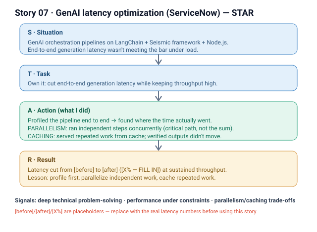

# 07 · GenAI latency optimization (ServiceNow)

**Signals:** deep technical problem-solving · performance under constraints · engineering judgment (parallelism / caching trade-offs)
**Answers questions like:** "the hardest technical problem you've solved" · "a time you optimized performance / latency" · "an engineering trade-off you made" · "how do you reason about a slow system?" · "when did you have to hit a performance bar under constraints?"

## The story (detailed STAR)
- **S — Situation:** *We* were building GenAI orchestration pipelines on **LangChain, the Seismic framework, and Node.js**. End-to-end generation latency was **[FILL IN — the baseline latency, e.g. "~Xs p95 per request"]**, and at **[FILL IN — target throughput / load]** it wasn't meeting the bar for **[FILL IN — the product surface / SLA the latency had to serve]**. *(That's the "we" — the team owned the pipeline together.)*
- **T — Task:** **I owned cutting end-to-end generation latency** while keeping throughput high — turning a slow multi-step LLM pipeline into one that met **[FILL IN — the latency / throughput target]**. The hard part: the work spanned several dependent LLM and retrieval steps, so there was **no single hot spot to fix** — I had to find where the time actually went.
- **A — Action (this is where it's "I"):**
  1. **Profiled the pipeline end to end** — measured each orchestration step to see where the latency actually accumulated **[FILL IN — the steps that dominated, e.g. sequential LLM calls / retrieval / prompt assembly]**, rather than guessing.
  2. **Introduced parallelism** — restructured independent steps to run **concurrently** instead of sequentially, so the pipeline's critical path shrank to the slowest branch rather than the sum of all steps.
  3. **Added caching** — cached **[FILL IN — what was cached: e.g. repeated retrievals / embeddings / intermediate generations]** so repeated or overlapping work was served from cache instead of re-computed, cutting redundant LLM/round-trip cost.
  4. **Guarded correctness under concurrency** — made sure parallelism and cached results didn't change outputs or introduce staleness **[FILL IN — how you validated correctness / set cache invalidation]**.
- **R — Result:** End-to-end generation latency dropped from **[FILL IN — before]** to **[FILL IN — after]** (**[FILL IN — % improvement]**) while sustaining **[FILL IN — throughput]**. Beyond the number, it set a **reusable pattern** for the team's LLM pipelines: *profile first → parallelize the independent work → cache the repeated work → verify outputs didn't move.*

## Key decisions I'd defend
- **Parallelism over sequential orchestration** — independent LLM/retrieval steps don't need to wait on each other, so running them concurrently collapses the critical path. *(Cost: more concurrent load / harder to reason about; managed with [FILL IN — concurrency limits / backpressure].)*
- **Caching the repeated work** — the cheapest request is the one you never re-run; caching **[FILL IN — the repeated layer]** removed redundant LLM calls. *(Cost: cache-staleness risk — traded off with [FILL IN — invalidation / TTL strategy].)*
- **Profile before optimizing** — I measured where the time went before touching code, so effort went to the steps that actually dominated latency, not a hunch.

## Likely follow-up probes (be ready)
- *"How did you know parallelism was safe?"* → the steps I parallelized had **no data dependency** on each other; dependent steps stayed ordered. **[FILL IN — the specific independent vs. dependent steps.]**
- *"What did you cache, and how did you avoid stale results?"* → cached **[FILL IN — the layer]** with **[FILL IN — invalidation / TTL]**; correctness verified via **[FILL IN — check]**.
- *"What was the trade-off?"* → parallelism raised concurrent load and complexity; caching added a staleness risk — both were worth it against the latency bar, and bounded with **[FILL IN — limits]**.
- *"What was YOUR part vs the team's?"* → the team built the pipeline; **I** owned the latency work — profiling → parallelism → caching → correctness verification → the shipped speedup.

## 60-second version (say this out loud)
"We were building GenAI orchestration pipelines on LangChain, the Seismic framework, and Node.js, and end-to-end generation latency wasn't meeting our bar. I owned cutting it. Instead of guessing, I profiled the pipeline end to end to see where the time actually went. Then I did two things: I restructured the independent steps to run in parallel instead of sequentially, so the critical path became the slowest branch rather than the sum of every step; and I added caching for the repeated work so we stopped re-running redundant LLM calls. I made sure concurrency and cached results didn't change the outputs. That cut end-to-end latency by [FILL IN — %] while holding throughput, and it gave the team a repeatable play for LLM pipelines: profile first, parallelize the independent work, cache the repeated work, verify the outputs didn't move."

## ⚠ Fill in before using
- [ ] Baseline vs. improved end-to-end latency (before / after) and the % improvement.
- [ ] The throughput target / load the pipeline had to sustain.
- [ ] Which steps dominated latency and which you parallelized (independent vs. dependent).
- [ ] What exactly you cached and the invalidation / TTL strategy.
- [ ] How you validated outputs didn't change under parallelism / caching.
- [ ] The product surface / SLA the latency had to serve.
