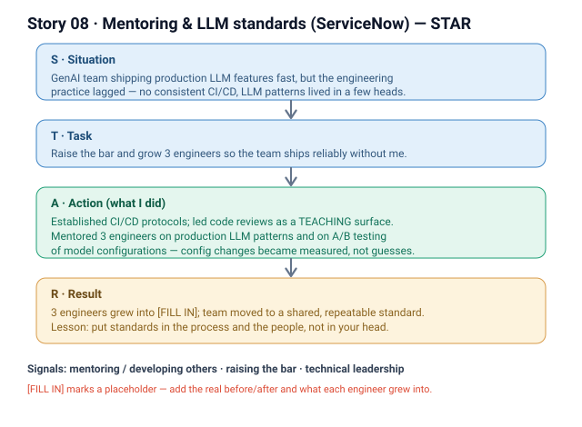

# 08 · Mentoring & production-LLM standards (ServiceNow)

**Signals:** mentoring / developing others · raising the engineering bar / standards · technical leadership
**Answers questions like:** "a time you mentored someone / grew a team" · "how you raised standards or set up a practice" · "how you level up other engineers" · "you brought rigor to a team that lacked it" · "how you scale yourself through others"

## The story (detailed STAR)
- **S — Situation:** On our GenAI team at ServiceNow, *we* were shipping production LLM features fast, but the engineering practice hadn't caught up with the work. There was **no consistent CI/CD discipline**, and **production-LLM patterns and A/B testing of model configurations** were new territory for most of the team — knowledge lived in a few heads, not in shared standards. *(That's the "we" — the whole team felt the gap.)*
- **T — Task:** **I took on raising the bar and growing the people** — establish repeatable engineering protocols *and* level up **3 engineers** [FILL IN — names/levels] so the team could ship production LLM work reliably without me in the loop for every change.
- **A — Action (this is where it's "I"):**
  1. **Established CI/CD protocols** — put in place the pipeline and process discipline [FILL IN — the specific gates: e.g., automated checks, deploy steps, review requirements] so shipping was consistent and safe rather than ad hoc.
  2. **Led code reviews** — used reviews not just as a gate but as a **teaching surface**, turning each one into a chance to transfer patterns and set the standard for what "good" looks like.
  3. **Mentored 3 engineers on production LLM patterns** — coached them on the real-world patterns of running LLMs in production [FILL IN — the specific patterns: e.g., prompt/config structure, guardrails, evaluation, fallbacks].
  4. **Mentored them on A/B testing of model configurations** — taught them to compare model configs empirically and let data pick the winner, so config changes became measured decisions instead of guesses.
- **R — Result:** The 3 engineers **grew into** [FILL IN — what each grew into: e.g., independently owning production LLM features / driving their own config experiments], and the team moved from ad-hoc shipping to a **shared, repeatable standard** [FILL IN — before/after: e.g., what CI/CD looked like before vs after]. The bigger win: the practice outlived my direct involvement — patterns lived in the process and the people, not just in my head.

## Key decisions I'd defend
- **Code review as a teaching surface, not just a gate** — investing the extra time in reviews compounded: every review leveled someone up and reinforced the standard. *(Cost: reviews took longer up front.)*
- **Standards in the process, not in my head** — establishing CI/CD protocols and shared LLM patterns so the team didn't depend on me was the point; the goal was to scale myself out of the critical path.

## Likely follow-up probes (be ready)
- *"What exactly did you mentor them on?"* → production LLM patterns and A/B testing of model configurations — how to run and compare configs empirically, not by hunch. [FILL IN — the concrete patterns.]
- *"How do you know the mentoring worked?"* → [FILL IN — the observable signal: e.g., they started owning features / running experiments without me]. The CI/CD protocols and review standard became how the team worked by default.
- *"What was YOUR part vs the team's?"* → the team felt the gap; **I** set up the CI/CD protocols, led the reviews, and personally coached the 3 engineers.
- *"How did you tailor mentoring to each person?"* → [FILL IN — how you adapted to each engineer's level/gaps].

## 60-second version (say this out loud)
"On our GenAI team at ServiceNow we were shipping production LLM features fast, but the engineering practice hadn't caught up — no consistent CI/CD, and production-LLM patterns and A/B testing of model configs were new to most of the team. I took on raising the bar: I established CI/CD protocols, led code reviews and used them as a teaching surface, and mentored 3 engineers on production LLM patterns and on A/B testing of model configurations so config changes became measured decisions, not guesses. The result was that those engineers grew into owning that work themselves, and the standard lived in the process and the people rather than in my head."

## ⚠ Fill in before using
- [ ] Who the 3 engineers were (levels/context) and what each grew into (before → after).
- [ ] The specific CI/CD protocols you put in place (gates, checks, deploy steps).
- [ ] The concrete production-LLM patterns you taught (prompt/config structure, guardrails, evaluation, fallbacks).
- [ ] The observable signal that the mentoring worked (what they could do after that they couldn't before).
