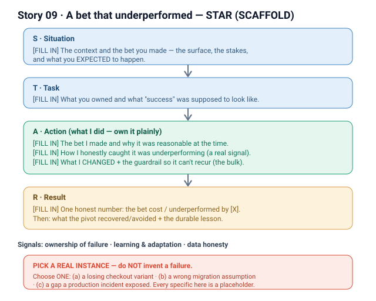

# 09 · A bet that underperformed + what I learned (Atlassian)

**Signals:** handling failure with ownership · learning & adaptation · intellectual honesty with data
**Answers questions like:** "tell me about a failure or mistake" · "something that didn't go as planned" · "a time you were wrong" · "a decision that didn't work out" · "what would you do differently?"

> ⚠ **This is a SCAFFOLD, not a finished story.** Your resume has no explicit failure written into it, so **nothing here is invented as fact.** Below is the *frame* for a strong failure answer plus **2–3 real anchors you already lived through** — pick ONE and fill it in. Do **not** make one up; SAP's leaders probe hard, and a fabricated failure collapses the moment they ask a second question.

## How to tell a failure honestly (the shape that lands)
- **Own it plainly, in the first sentence.** "I was wrong about X." No hedging, no blaming the team, the data, or the deadline. Ownership *is* the signal they're scoring.
- **Keep the "what went wrong" SHORT** — 2–3 sentences. Enough for them to understand the miss; not a wallow.
- **Spend most of the answer on what you CHANGED** — the decision, the process, the guardrail — **and the result afterward.** A good failure story is really a *learning-and-adaptation* story with a real result at the end.
- **Bring one honest number.** The bet underperformed *by a measurable amount* — say it. Intellectual honesty with data is the third signal.
- **End forward-looking:** the habit or check you now apply by default, so this class of miss can't recur.

## The story (detailed STAR)
> **PICK ONE real anchor** from the candidates below, then flesh out the S/T/A/R. All specifics are `[FILL IN]` until you choose.

- **S — Situation:** [FILL IN — the context and the bet you made. One or two lines. Name the surface, the stakes, and what you *expected* to happen.]
- **T — Task:** [FILL IN — what you owned and what "success" was supposed to look like at the time you committed to the bet.]
- **A — Action (this is where it's "I"):**
  1. **The bet I made and why** — [FILL IN — the hypothesis/decision, and the reasoning that made it defensible *at the time* (not obviously dumb in hindsight).]
  2. **How I caught that it was underperforming** — [FILL IN — the metric / dashboard / incident / user signal that told me, honestly, that this wasn't working.]
  3. **What I changed** — [FILL IN — the pivot: killed the variant / rolled back / re-architected / added the guardrail. THIS is the bulk of the answer.]
  4. **How I made it stick** — [FILL IN — the process change or check I institutionalized so the same miss can't recur.]
- **R — Result:** [FILL IN — quantified. The bet cost/underperformed by [X], the pivot recovered/avoided [Y], and the durable lesson is [Z].]

### Candidate REAL anchors — `[PICK ONE — real instance]`
Choose the one you can defend with real detail and one honest number. Each is grounded in work already in your story bank (stories 01–05), so it's *your* material — you just need to recall the specific instance.

- **(a) A losing variant in the multi-variant checkout experiment (Story 01).** `[PICK ONE — real instance]`
  - *Frame:* "I was confident variant [FILL IN] would win — it matched my mental model of why users dropped off. It lost / it *hurt* conversion by [X%]." The honesty: your hunch was wrong, and the data said so. The learning: this is exactly *why* you'd flagged and cohorted it — the experiment design let you kill your own favorite cheaply instead of shipping it. Good if you want a failure that shows *disciplined process already caught the miss.*
  - *Watch-out:* don't let it sound like "no real failure because the process saved me." Own that **you** genuinely believed the losing variant.

- **(b) An assumption that proved wrong during the DC → Cloud or ECC → BAC migration (Stories 02, 03).** `[PICK ONE — real instance]`
  - *Frame:* "I assumed [FILL IN — e.g., a data shape / a customer usage pattern / a cutover would be backward-compatible], planned around it, and it was wrong — which cost us [X: rework / a delayed cohort / a rollback]." The learning: what you now validate up front (a discovery step, a canary cohort, a contract test) before committing a migration plan. Good if you want a failure with *enterprise stakes and ambiguity.*

- **(c) A gap that a production incident exposed (Story 05).** `[PICK ONE — real instance]`
  - *Frame:* "We shipped [FILL IN] believing [assumption]; an incident revealed a gap I'd underweighted — [missing guardrail / monitoring blind spot / edge case]. Impact was [X — duration / affected customers]." The learning: the specific guardrail, alert, or review step you added so that class of incident is now caught before it reaches customers. Good if you want failure told as *leadership under pressure + raising the bar.*

## Key decisions I'd defend
> Fill these once you've picked an anchor. Suggested shape:
- **Why the bet was reasonable at the time** — [FILL IN] — so it reads as a real judgment call, not negligence.
- **Why I pivoted when I did, not later** — [FILL IN — the threshold/evidence that made me stop defending the bet]. *(The signal: I follow the data even when it contradicts me.)*

## Likely follow-up probes (be ready)
- *"How quickly did you realize it wasn't working?"* → [FILL IN — the signal and the honest lag; don't pretend it was instant.]
- *"What did it cost?"* → [FILL IN — one honest number: rework, delay, conversion, incident minutes.]
- *"What would you do differently now?"* → [FILL IN — the guardrail/check you now apply by default — the durable lesson.]
- *"Did you tell anyone it was your call?"* → yes; [FILL IN — how you owned it with the team/stakeholders]. *(Ownership under scrutiny is the whole point.)*

## 60-second version (say this out loud)
> Skeleton — swap the `[FILL IN]`s once you've picked an anchor:
"[FILL IN — one-line context and the bet]. I was wrong: [FILL IN — the miss, in one sentence, with one honest number]. What I did about it matters more — [FILL IN — how I caught it, what I changed, and the guardrail I put in so it can't recur]. Afterward, [FILL IN — the recovered/avoided result]. The lasting change is that I now [FILL IN — the default check], so I don't ride a bet past the point the data stops supporting it."

## ⚠ Fill in before using
- [ ] **PICK ONE anchor** (a, b, or c) — the real instance you'll tell. Do NOT invent one.
- [ ] The one honest number: how much the bet cost / underperformed by.
- [ ] The exact signal that told you it wasn't working (metric / incident / user data).
- [ ] The concrete change you made afterward + the durable guardrail/check.
- [ ] The recovered or avoided result once you pivoted.
