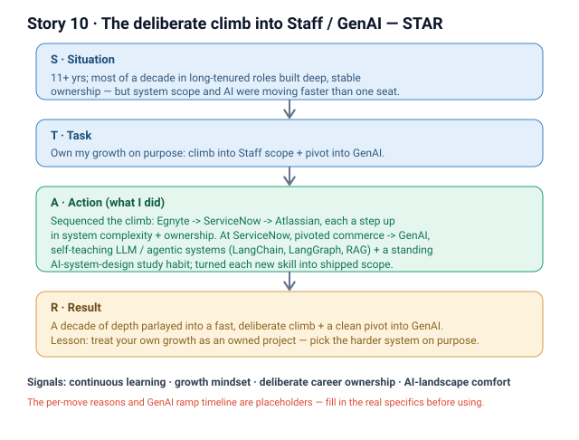

# 10 · The deliberate climb into Staff / GenAI (Career)

**Signals:** continuous learning / learning agility · growth mindset · deliberate career ownership · comfort in a fast-evolving AI landscape
**Answers questions like:** "tell me about a time you learned something new quickly" · "how do you grow / keep your skills current?" · "why this pivot / why AI?" · "how do you adapt to a fast-changing field?" · "what does deliberate career ownership look like for you?"

## The story (detailed STAR)
- **S — Situation:** I have **11+ years** of engineering, and for most of a decade *we* built products in **long-tenured roles** — deep, stable ownership of full-stack and commerce systems. *(That's the "we" — teams I grew inside of over years.)* The tenure gave me depth, but I could see the industry's center of gravity — especially system scope and AI — moving faster than a single long-held seat would stretch me.
- **T — Task:** **I decided to own my own growth deliberately** rather than let it happen by default — to make a **conscious climb into Staff-level scope**, with each move a **step up in system complexity and ownership**, and to **pivot from commerce/full-stack engineering into GenAI** even though it meant learning a whole new stack fast.
- **A — Action (this is where it's "I"):**
  1. **Sequenced the climb on purpose** — **Egnyte → ServiceNow → Atlassian**, choosing each move so the *next* system was bigger and my *ownership* wider, not just a title change. [FILL IN — the specific reason for each move: what larger system / harder problem each step unlocked.]
  2. **Made the AI pivot a first-class bet** — at **ServiceNow** I moved from commerce/full-stack into **GenAI**, teaching myself **LLM / agentic systems** (**LangChain, LangGraph, RAG**) rather than waiting to be trained into it. [FILL IN — how I ramped: what I built first, timeline from zero to shipping, resources I used.]
  3. **Built a standing learning habit** — I **self-study AI system design** on an ongoing basis so I stay current as the field moves. [FILL IN — the concrete cadence: what I study, how often, one recent thing I learned and applied.]
  4. **Converted learning into ownership** — each new capability I picked up I turned into real shipped scope at Staff level, not just knowledge on paper. [FILL IN — one concrete example where self-taught GenAI knowledge became a shipped system.]
- **R — Result:** A **decade of long-tenured depth deliberately parlayed into a recent, fast climb** — Egnyte → ServiceNow → Atlassian, each a step up in system complexity and ownership — and a **clean pivot from commerce engineering into GenAI** where I now work in LLM/agentic systems. The durable lesson: **I treat my own growth as an owned project** — pick the harder system on purpose, learn the new stack faster than the field forces me to, and keep a standing habit so I'm comfortable when the ground keeps moving. [FILL IN — one crisp outcome that proves the climb landed: a Staff-scope system I own now, or an AI thing I shipped that I couldn't have a year earlier.]

## Key decisions I'd defend
- **Climb by system complexity, not title** — I chose each move (Egnyte → ServiceNow → Atlassian) for a bigger system and wider ownership, so the growth was real, not cosmetic. *(Cost: leaving comfortable, well-understood ground each time.)*
- **Pivot into GenAI by self-teaching, not by waiting** — I learned LLM/agentic systems (LangChain, LangGraph, RAG) proactively rather than staying in commerce until someone handed me the work. *(Cost: ramping on a new stack while still delivering.)*

## Likely follow-up probes (be ready)
- *"Why leave long-tenured roles at all?"* → the tenure built my depth; the climb was a deliberate choice to stretch scope and ownership faster than one seat would. [FILL IN — the specific trigger for the first move.]
- *"How did you actually learn GenAI so fast?"* → self-taught LLM/agentic systems (LangChain, LangGraph, RAG) at ServiceNow + a standing AI-system-design study habit. [FILL IN — what I built first / how long to first ship.]
- *"How do you stay current when AI changes monthly?"* → I keep a standing self-study habit in AI system design and turn what I learn into shipped scope. [FILL IN — cadence + one recent example.]
- *"What was YOUR part vs the team's?"* → the *depth* was built with teams over years; the *climb and the pivot were my own deliberate calls* — I chose each move and taught myself the new stack.

## 60-second version (say this out loud)
"I've got 11-plus years, and most of a decade of that was long-tenured roles that built my depth. But I decided to own my growth deliberately instead of coasting — so I made a conscious climb, Egnyte to ServiceNow to Atlassian, each move a real step up in system complexity and ownership, not just a title. The biggest piece was a pivot: at ServiceNow I moved from commerce and full-stack into GenAI and taught myself LLM and agentic systems — LangChain, LangGraph, RAG — rather than waiting to be trained into it, and I keep a standing habit of self-studying AI system design so I stay current. The lesson I'd carry into this role: I treat my own growth as an owned project — pick the harder system on purpose, learn the new stack faster than the field forces me to, and stay comfortable while the ground keeps moving. That's exactly the muscle a fast-evolving AI role needs."

## ⚠ Fill in before using
- [ ] The specific reason for each move (Egnyte → ServiceNow → Atlassian) — what larger system / harder problem each unlocked.
- [ ] How you ramped on GenAI: what you built first, timeline from zero to shipping, resources/approach.
- [ ] Your concrete self-study cadence + one recent thing you learned and applied.
- [ ] One crisp outcome that proves the climb landed (a Staff-scope system you own now, or an AI thing you shipped you couldn't have a year earlier).
