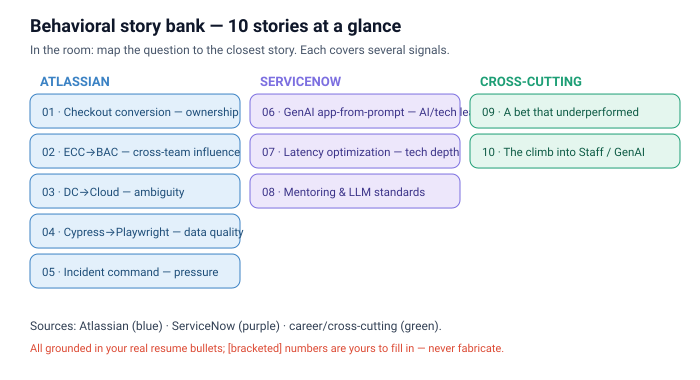

# Behavioral story bank — Neeraj (SAP FDE)

10 STAR stories from **real** Atlassian + ServiceNow (+ career) work, each mapped to the signals SAP's leaders probe. One file per story so you can grab the right one fast.

## How to use
- **Don't memorize answers.** Learn the ~10 stories; in the room, *map the question to the closest one.*
- Each file has: **Signals · S/T/A/R · question-types it answers · the 60-second version.**
- `[bracketed]` = a real number/detail **you** must fill in. Never invent one — leaders probe.
- STAR reminder: **S**ituation (1 line) → **T**ask (your goal) → **A**ction (what *you* did — the bulk) → **R**esult (quantified + lesson).

## The 10 stories
| # | Story | Source | Primary signals |
|---|---|---|---|
| 01 | Checkout-conversion experiment (M3) | Atlassian | Ownership · Data-driven · Impact |
| 02 | ECC → BAC consolidation | Atlassian | Cross-team leadership · Influence w/o authority |
| 03 | Data Center → Cloud migration | Atlassian | Ambiguity · Complexity · Enterprise stakes |
| 04 | Cypress → Playwright migration | Atlassian | Initiative · Data-driven quality · Ownership |
| 05 | Incident command (war rooms) | Atlassian | Leadership under pressure · Communication |
| 06 | GenAI app-from-prompt architect | ServiceNow | Technical leadership · Building new under ambiguity · **AI** |
| 07 | GenAI latency optimization | ServiceNow | Technical depth · Performance under constraints |
| 08 | Mentoring & production-LLM standards | ServiceNow | Mentoring · Raising the bar |
| 09 | A bet that underperformed + what I learned | Atlassian | Failure · Learning · Data honesty |
| 10 | The deliberate climb into Staff / GenAI | Career | Continuous learning · Growth mindset |

## Signal × story matrix (✓ = this story can answer that theme)
| Signal ↓ / Story → | 01 | 02 | 03 | 04 | 05 | 06 | 07 | 08 | 09 | 10 |
|---|---|---|---|---|---|---|---|---|---|---|
| End-to-end ownership | ✓ | ✓ | ✓ | ✓ |  | ✓ |  |  | ✓ |  |
| Ambiguity |  | ✓ | ✓ |  | ✓ | ✓ |  |  | ✓ | ✓ |
| Data-driven | ✓ |  |  | ✓ | ✓ |  | ✓ |  | ✓ |  |
| Leadership / influence |  | ✓ |  | ✓ | ✓ | ✓ |  | ✓ |  |  |
| Communication (esp. to non-eng) |  | ✓ | ✓ |  | ✓ |  |  | ✓ |  |  |
| Mentoring |  |  |  |  |  |  |  | ✓ |  | ✓ |
| Failure / learning |  |  |  | ✓ |  |  |  |  | ✓ | ✓ |
| Customer-centric | ✓ |  | ✓ |  | ✓ | ✓ |  |  |  |  |

