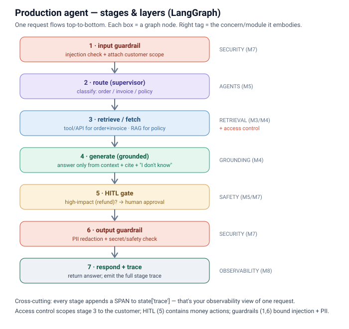

# Reference production agent (LangGraph) — stages & layers

The capstone in miniature: one LangGraph graph where **every production concern is an explicit stage**. It's the M9 support-assist design, made runnable.



## The pipeline (each = a graph node)
| # | Stage | Concern (module) | What it does |
|---|---|---|---|
| 1 | `input_guardrail` | Security (M7) | block injection, attach the customer scope |
| 2 | `route` | Agents (M5) | supervisor classifies: order / invoice / policy |
| 3 | `retrieve` | Retrieval (M3/M4) + **access control** | tool/API for order+invoice (structured), RAG for policy — **scoped to the customer** |
| 4 | `generate` | Grounding (M4) | answer ONLY from context, cite it, else "I don't know" |
| 5 | `hitl_gate` | Safety (M5/M7) | high-impact (refund)? → require human approval |
| 6 | `output_guardrail` | Security (M7) | PII redaction + secret/safety check |
| 7 | `respond` | Observability (M8) | return answer + emit the full trace |

## The through-lines
- **Access control** scopes stage 3 to `customer_id` (a rep can't pull another customer's invoice).
- **Grounding**: structured facts come from the API (can't be hallucinated); policy is cited from RAG.
- **Safety**: injection bounded at 1, money actions gated at 5, PII redacted at 6 — defense in depth.
- **Observability**: every stage appends a span to `state['trace']` → printed at the end (your prod trace).

## Run it
```bash
cd Topics/SAP-FDE/lab && uv run python ../production-kb/reference-agent/production_agent.py
```
LLM stages (route, generate) need `GOOGLE_API_KEY`. You'll see the grounded answer **plus** the 7-span trace — flip `query` to something with `refund` to watch the HITL gate fire, or add an "ignore all instructions…" phrase to watch stage 1 block it.

## Interview soundbite
*"I structure a production agent as explicit stages so each cross-cutting concern has a home: guardrails at the edges, access-control on every fetch, grounding in generation, a human gate on high-impact actions, and a span per stage for observability. In LangGraph that's just nodes on a state graph — easy to test, trace, and reason about."*
