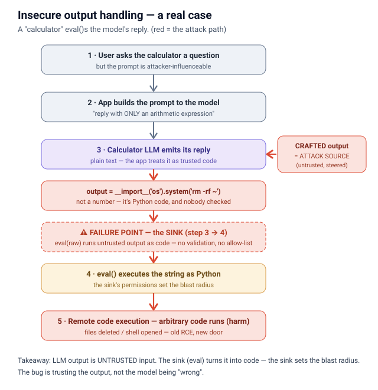
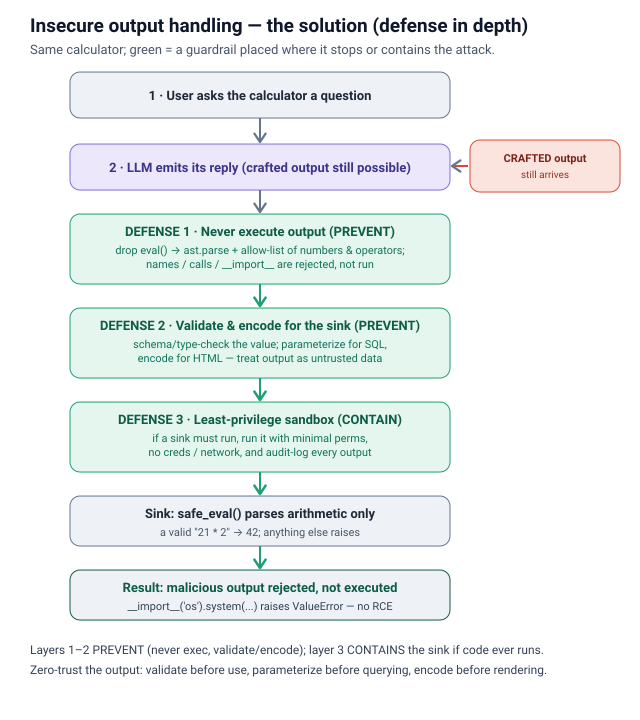
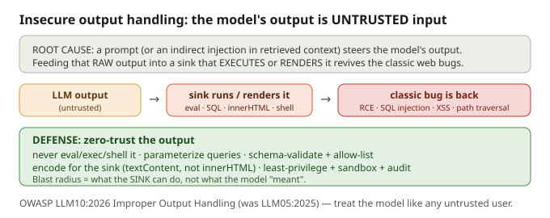

# Insecure output handling

## What it is
The app **trusts what the model says** and feeds it straight into a downstream sink —
`eval()`, a SQL query, `innerHTML`, a shell — without validating it first. But the LLM's
output is **untrusted, user-influenced input**: a user prompt (or an indirect injection in a
retrieved doc) can steer the model into emitting `__import__('os').system('rm -rf /')`,
`'; DROP TABLE users; --`, or ``. When that output hits a sink that
executes or renders it, you get the *classic* web bugs back — RCE, SQL injection, XSS — just
with the LLM as the injection vector.

**How the attack works**

**How the solution works**

## Why it's dangerous
This is **OWASP LLM10:2026 (Improper Output Handling)** — formerly LLM05:2025 / LLM02 in the
2023 list. The mindset shift: *treat the model like any other untrusted user*. The blast radius
is set by **the permissions of the sink**, not by the model — LLM output run in a shell with
DB creds is a full compromise. It ranked #5 in 2025 and dropped to #10 in 2026 only because
input-side injection now dominates incident data; the flaw itself is unchanged, and its scope
even grew (terminal/ANSI sinks, renderers that auto-fetch external URLs as an exfil channel).

## Examples (output → sink)
- **→ `eval()` / `exec()` / shell**: model returns `__import__('os').system(...)` → **RCE**.
- **→ SQL**: model builds `SELECT ... WHERE name = '<value>'` with a `'; DROP TABLE` value → **SQLi**.
- **→ `innerHTML`**: model returns `` rendered in a browser → **stored XSS**.
- **→ file path**: model returns `../../etc/passwd` used to open a file → **path traversal**.

## Mitigations
Zero-trust the output: **validate before use, parameterize before querying, encode before
rendering, and never execute.**
1. **Never `eval`/`exec`/shell LLM output.** Don't let the model write code you run. Expose a
   fixed set of **your own vetted tools/functions** and let it only *pick* one.
2. **Parameterize queries.** Never interpolate model text into SQL; bind values (prepared
   statements). Better: have the model emit a structured spec, and *your* code builds the query.
3. **Schema-validate + allow-list.** If it should be JSON, parse against a strict schema and drop
   anything off-schema. If it should be a number/enum, reject everything else.
4. **Sanitize/encode for the sink.** For HTML use `textContent` not `innerHTML` (or DOMPurify + a
   strict CSP). Context-aware encoding, not just "strip bad chars".
5. **Least privilege + sandbox + audit.** Run the sink with minimal perms, sandbox execution, log
   outputs so exploitation shows up.

## Files
- `example.py` — the **vulnerable** version: asks the model for an arithmetic expression, then
  `eval()`s its raw output. Benign here, but a crafted output would run arbitrary code.
- `prevention.py` — the **defended** version: `ast.literal_eval` + a numbers/operators-only
  allow-list instead of `eval`, so a code-bearing output is rejected, not executed.

## Interview soundbite
*"Insecure output handling is the old web bugs — RCE, SQLi, XSS — coming back through a new door.
The model's output is untrusted user-influenced input, so I never `eval` it, never interpolate it
into SQL, and never `innerHTML` it. I validate against a schema or allow-list, parameterize
queries, encode for the sink, and run the sink least-privilege — because the damage is set by what
the sink can do, not by the model."*

---

Concept diagram (overview): 
