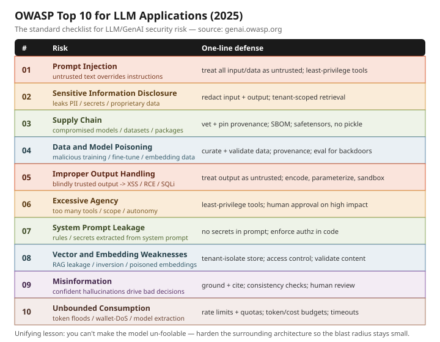

# OWASP Top 10 for LLM Applications

## What it is
A community-driven, industry-standard list of the **10 most critical security risks**
specific to apps built on large language models. It's the shared vocabulary security teams,
architects, and interviewers use to reason about LLM/GenAI risk — the LLM equivalent of the
classic OWASP Top 10 for web apps. This folder is a **REFERENCE / overview topic**: it maps the
landscape and points you at the sibling KB topics that cover each risk in depth (with vulnerable
+ defended demos). There is **no vulnerable demo and no `prevention.py`** here — see the linked
topics for those.

**Source (canonical):** OWASP GenAI Security Project — https://genai.owasp.org/ ·
2025 list: https://genai.owasp.org/resource/owasp-top-10-for-llm-applications-2025/

## The 10 risks (OWASP LLM Top 10 — 2025)
Each risk: what it is · **Defense** · link to the deep-dive KB topic (where we have one).

1. **LLM01 — Prompt Injection.** Untrusted text (user input *or* ingested data) overrides the
   model's instructions, because instructions and data share one token stream.
   **Defense:** treat all external content as untrusted, least-privilege tools, human-in-the-loop
   on irreversible actions, output guardrails. → [prompt-injection](../prompt-injection/explanation.md)
   · related: [jailbreaks](../jailbreaks/explanation.md)

2. **LLM02 — Sensitive Information Disclosure.** The model leaks PII, secrets, or proprietary data
   via its output, memorized training data, or a retrieved RAG chunk.
   **Defense:** scrub/redact inputs and retrieved data, output scanning, tenant-scoped retrieval,
   don't train on secrets. → [sensitive-info-disclosure](../sensitive-info-disclosure/explanation.md)
   · [pii-redaction](../pii-redaction/explanation.md)

3. **LLM03 — Supply Chain.** Compromised or unvetted base models, adapters, datasets, plugins, or
   packages (unsafe serialization, rogue model registries).
   **Defense:** vet/pin model + dependency provenance, checksums/signing, SBOM, avoid unsafe
   deserialization (e.g. pickle) — use safetensors. *(reference only — no sibling topic yet)*

4. **LLM04 — Data and Model Poisoning.** Malicious data slipped into pre-training, fine-tuning, or
   embedding data creates backdoors or biased/harmful behavior.
   **Defense:** curate and validate training data, provenance tracking, anomaly detection,
   evaluate models for backdoors before promotion. *(reference only — no sibling topic yet)*

5. **LLM05 — Improper Output Handling.** Downstream systems trust model output blindly, so
   generated code/SQL/HTML causes XSS, RCE, SQLi, or SSRF.
   **Defense:** treat model output as untrusted input — validate, encode/escape, parameterize,
   allow-list, sandbox. → [insecure-output-handling](../insecure-output-handling/explanation.md)

6. **LLM06 — Excessive Agency.** The model has too much permission/autonomy — too many tools,
   too much scope — so a bad output triggers real, damaging actions.
   **Defense:** least-privilege tools, minimal scopes, human approval on high-impact actions,
   deterministic guards around tool calls. → [excessive-agency](../excessive-agency/explanation.md)

7. **LLM07 — System Prompt Leakage.** The system prompt (containing rules, secrets, or logic the
   app relies on) is extracted, revealing guards or embedded credentials.
   **Defense:** never put secrets/authz logic *in* the prompt — enforce it in code; assume the
   prompt is public. *(reference only — no sibling topic yet)*

8. **LLM08 — Vector and Embedding Weaknesses.** Flaws in RAG vector stores: cross-tenant leakage,
   embedding-inversion, or poisoned embeddings that manipulate retrieval.
   **Defense:** tenant-isolate the vector store, access controls on retrieval, validate/curate
   embedded content, re-index on embedder change. *(reference only — see the `data` pillar)*

9. **LLM09 — Misinformation.** Confident but wrong output (hallucination) drives flawed decisions,
   especially when it feeds automated workflows.
   **Defense:** ground with RAG + citations, confidence/consistency checks, human review for
   high-stakes outputs, evals for factuality. *(reference only — see the `quality` pillar)*

10. **LLM10 — Unbounded Consumption.** Uncontrolled inference — token floods, wallet/DoS attacks,
    model-extraction querying — causes cost blowups and resource starvation.
    **Defense:** rate limits + quotas per user/tenant, token/cost budgets, timeouts, input-size
    caps, monitoring & alerts. *(reference only — see the `cost` / `scalability` pillars)*

## How the risks group (mental model for interviews)
- **Input side:** LLM01 (injection), LLM04 (poisoning), LLM08 (vector/embedding).
- **Output side:** LLM05 (output handling), LLM09 (misinformation).
- **Data leak:** LLM02 (sensitive info), LLM07 (system prompt).
- **Agency / blast radius:** LLM06 (excessive agency).
- **Foundation / platform:** LLM03 (supply chain), LLM10 (unbounded consumption).

The through-line matches our prompt-injection philosophy: **you can't make the model
un-foolable, so harden the surrounding architecture** — least privilege, validate everything
crossing a trust boundary, gate irreversible actions, and cap consumption — so a compromised
model has a small blast radius.

> **Version note:** The 2025 list above is the stable, widely-cited enumeration. OWASP published a
> **2026** refresh (Aug 2026) that reorders and renames some entries — notably *Excessive Agency*
> climbs (agentic incidents), and *System Prompt Leakage* is reframed as **Hidden Context
> Exposure**. The risk categories are essentially the same; the 2025 codes remain the common
> interview reference. Always cite the current list from https://genai.owasp.org/ .

## Files
- `example.py` — an **offline self-audit checklist**: prints the 10 risks each with a one-line
  control question to ask of a system under review. No LLM, no network, no API key.
- (No `prevention.py` — this is a reference/overview topic; the fixes live in the linked sibling topics.)

## Interview soundbite
*"The OWASP LLM Top 10 is my checklist for AI risk. The headline is that prompt injection and
sensitive-info disclosure sit at the top, but the unifying lesson is architectural: you can't
build a model that can't be fooled, so you harden everything around it — least-privilege tools to
limit excessive agency, treat model output as untrusted to stop insecure output handling,
tenant-isolate retrieval, and cap consumption. Assume the model gets compromised and make sure
the blast radius is small."*
