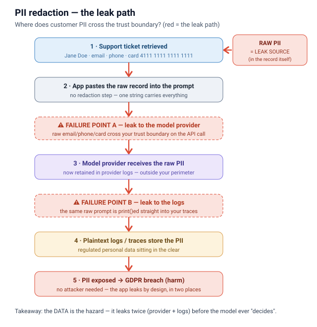
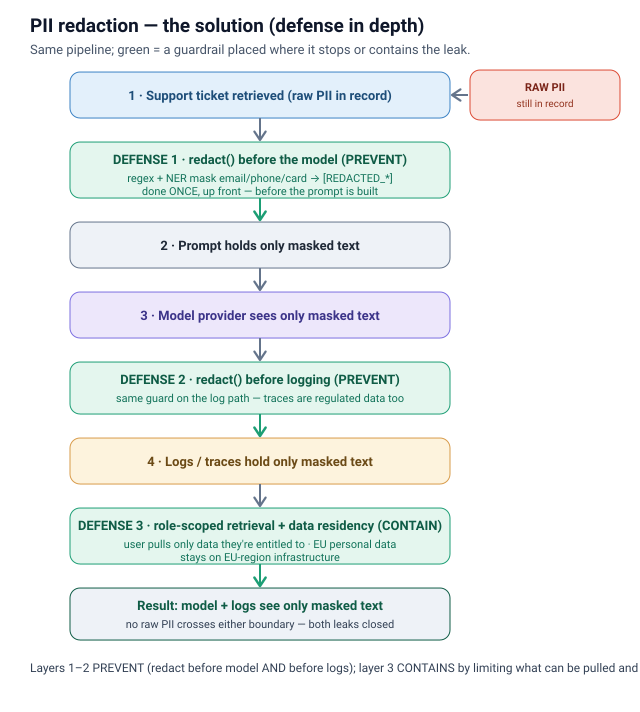
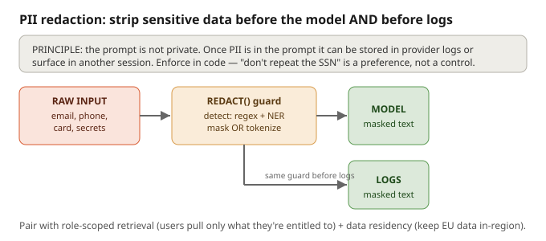

# PII redaction & data minimization

## What it is
**Detect and strip sensitive data (PII, secrets) BEFORE it ever reaches the model — and before it
lands in a log.** The safest prompt is not the one that *tells* the model to ignore personal data;
it's the one that **never contains** data the model doesn't need. This is **data minimization**:
send the least context required, replace identifiers with placeholders, and keep the map back to the
real values under your control.

**How the leak happens**

The vulnerable summarizer (`example.py`) pastes a raw customer record straight into the prompt and
into the logs — so the same PII crosses your trust boundary **twice**: once to the model provider,
once to your plaintext logs. No attacker required; the app leaks by design.

**How the solution works**

`prevention.py` runs `redact()` as a hard dependency in the path — masking email/phone/card **before**
the prompt is built (PREVENT) and again **before** anything is logged (PREVENT). Role-scoped retrieval
and data residency (CONTAIN) limit what can be pulled and where it lives. The model and the logs only
ever see masked text.

## Why it matters
- **The prompt is not private.** Once PII is in a prompt it can be stored in provider logs, surface
  in another session, or become evidence in a regulatory finding. By the time the model is
  "deciding" what to do, the data has **already left your perimeter**.
- **Prompt instructions are not a privacy control.** "Don't repeat the SSN" is a probabilistic
  preference, not a guarantee. Privacy has to be enforced **deterministically in your own code**.
- **Logs leak too.** Prompts, responses, and tool calls written to your traces/observability stack
  are **regulated personal data**. A redaction pipeline that only cleans the model call but logs the
  raw prompt has just moved the leak, not closed it.
- **Regulated-enterprise stakes (2026).** GDPR data-minimization (Art. 5) and the EU AI Act's
  high-risk obligations (data governance + logging, live Aug 2026) make this a compliance
  requirement, not a nice-to-have. Penalties reach €35M / 7% of global turnover.

## Techniques
1. **Detect — regex + NER.** Regex catches known shapes (email, phone, credit-card-like digit runs,
   API keys, national IDs). A NER/NLP model catches names, addresses, and free-text PII that regex
   misses. Prefer **structured redaction** first (you often know the field is `user_email`), then
   supplement with pattern scrubbing over all string values. Detection is fast (ms) — no second LLM.
2. **Mask (irreversible) vs. tokenize/pseudonymize (reversible).**
   - **Masking** replaces with a static placeholder and keeps **no map** → anonymized, out of GDPR
     scope. Use for analytics, training data, and logs.
   - **Tokenization / pseudonymization** replaces each entity with a **consistent token** (e.g.
     `customer <PERSON_1>`, `card ending 1234`) and keeps the token→value map **inside your
     network**. The model reasons over tokens; you **rehydrate** real values in the final answer so
     the user still sees their own name. Reversible → still regulated (GDPR Art. 4(5)), but rewarded.
3. **Redact before the model AND before logs.** Two independent choke points. In agentic systems,
   redaction must sit at **every outbound model call** — one user turn fans out into tool calls,
   retrieved context, and synthesis, and each hop is a fresh chance to leak (or to pull in new PII
   from a tool result). Make it a hard dependency in the path, not optional middleware.
4. **Role-scoped retrieval (least-privilege RAG).** A user should only retrieve data they're allowed
   to see. Enforce RBAC/ABAC at the index/collection/document level, filter retrieved chunks to the
   caller's authorized set, and audit every retrieval. Redaction complements this — it doesn't
   replace it. (Advanced: intent-aware checks that block anomalous access patterns at runtime.)
5. **Data residency.** Every API/vector call can be a cross-border transfer event. Keep EU personal
   data on EU-region infrastructure (or self-host/VPC-isolate for the most sensitive cases), use
   region-scoped token vaults, and ensure a lawful transfer mechanism (SCCs, DPF) before routing PII
   across borders.

## Files
- `example.py` — the **vulnerable** version: raw email, phone, and a card-like number are dropped
  straight into the prompt and echoed into the log. The PII leaves the perimeter and hits the logs.
- `prevention.py` — the **defended** version: a `redact()` guard masks PII **before** the model call
  and **before** any print/log. The model still does its job on the redacted text; no raw PII is
  logged.

## Interview soundbite
*"I treat the prompt and the logs as two places PII must never reach in the raw. Before any model
call I run deterministic detection — regex plus NER — and either mask it (irreversible, out of GDPR
scope) or tokenize it with the map kept inside my network so I can rehydrate the real values in the
final answer. Same guard runs before anything is logged, because traces are regulated data too. And
redaction isn't the whole story — I pair it with role-scoped retrieval so a user only pulls data
they're entitled to, and keep EU data in-region. Prompt instructions like 'don't repeat the SSN' are
a UX nicety, never the control."*

---

Concept overview (original schematic): 
